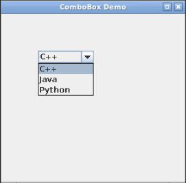

## Scenario 
You are learning how to develop GUI designed software. You would like to set up a demo design to check the viability of a `JComboBox` `Swing` class in your GUI design.  Your project will demonstrate the `JComboBox` with three drop-down options.

## Instructions
In this exercise, you will use the `Swing` GUI commands and statements to develop a demonstration of the `JComboBox`. You will use `JFrame` and `JComboBox` to develop the simple combo box demonstration GUI. You will debug the syntax and logic errors so that the demonstration of the combo box works effectively.

An example of the program is shown below: 

